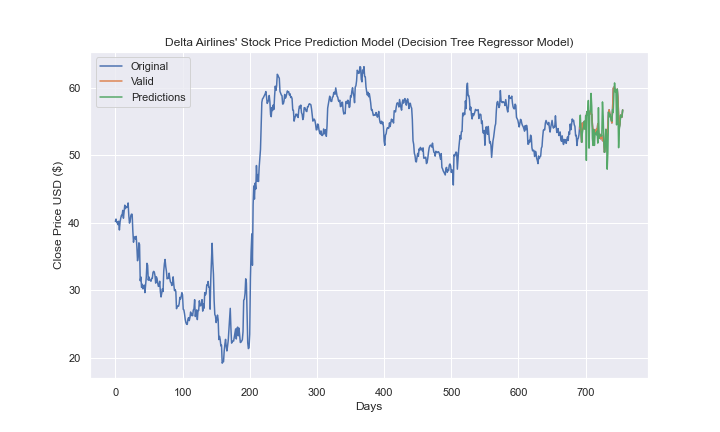

## Background
<h3> Everybody wants to be ahead of stocks.. with Machine Learning, this is now (somewhat) possible! </h3>
  
  In our final project, we decided to analyze stock data related to the top 6 flight companies to see where their stock may be in 65 days. 
  
  The process started in Project 2 where flight company stock data was cleaned and filtered. You can find this process [here](https://github.com/pmhu4242/Project_2/tree/main/Stock%20Market%20vs%20Covid). Very basically, this involved changing column names, merging data sets and other minor fixes.
  
  We then used Plotly to visualize the current data:

  
  <h3> Part 2: Machine Learning and Predicting </h3>
  
  We then used machine learning to predict the outcome of the stock price in 65 days. The process involved training our models (we used both a linear regression and a decision tree model). Our outcomes ended with a test score slightly above 50%. While ideal in the sense that the predicitions were better than a coin toss, we wanted a model that could predict with more certainty. In retrospect, we should've used a smaller chunk of data to predict so as to eliminate any major discrepancies that may have occurred with a larger data set. As well, this would help keep the predictions more up-to-date.
  
  Here is an example of a **somewhat** realistic predicition:
  
  
  
  The drastic spikes indicate there are still some problems with our methodology. It could also be related to the model as we found out that the linear regression model led to even weirder results. Take a look at this prediction for Delta airlines using the linear regression model:
  
  
  
  We are mainly highlighting Delta Airlines in this Readme however we have a few other predictions which can be found in this [link to our Dashboard!](https://teresaflicek.github.io/Airline-Stock-Analysis/AirlineStockAnalysis/)
  
In the dashboard, you'll find two other airlines and our predictions as to how their stock price will change in the next 65 days.

<h3> Conclusion </h3>

Although our Machine Learning didn't work perfectly, it did give us insight into what it takes to create a successful (and useful) machine learning model. We also learned how to weave different languages like Python and Javascript into a single project. 

And the most important conclusion of all: Buy airline stock now!

(Disclaimer: Just because our machine learning models are spitting out predicitions, we aren't experts. Take our advice at your own risk and please be responsible with your investments.)
